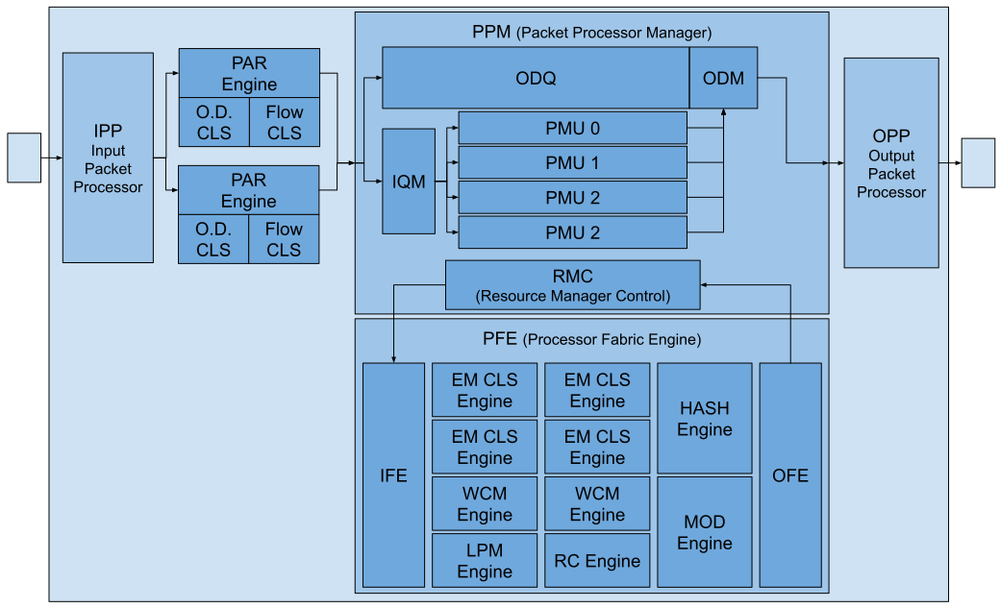

= PPC
include::../../utils/attribute-include[]
:experimental:

== Overview

The Programmable Packet Processor Complex (PPC) is a high-performance, fully programmable networking engine designed to handle wire-speed packet processing for modern data center and carrier-grade environments.

The PPC architecture is optimized for a Partial Configurable Stage model, allowing for extreme flexibility in protocol handling while maintaining strict hardware-level performance guarantees.

Key Capabilities:

* **Packet Parsing:** Parsing up-to `64` Bytes, supporting L2-L3 Protocols
* **Configurable Ordering Domain**
* **Classification:** Multi-Engine Packet Classification: EM, WCM, LPM Algorithem
* **Traffic Engineering:** Support for Mirroring, Multicasting, and Hashing.
* **Packet Modification:** Supporting Encapsulation, Decapsulation, NAT via INSERT, REMOVE and REPLACE actions.

== pipeline

.Block Diagram

Fully Programmable Packet Processing Pipeline.
Pipeline support:

[cols="1,3"]
|===
|Stage                         |Execution Characteristic

|Ingress                       |Strict In-Order
|Parsing & O.D. Classification |Strict In-Order (Assignment of Flow/Ordering IDs)
|Packet Processing             |Out-Of-Order (Parallel execution across PMUs)
|Processing Fabric Engine      | Asynchronous (Request/Response via RMC)
|Egress                        | Strict In-Order (Re-sequencing via ODQ/ODM)
|===

The Pipeline is a Partial Configurable Stage Architecture.

=== IPP
Input Packet Processor

''''

=== PAR Engine
Parser Engine

''''

=== O.D. CLS
Ordering Domain Classifer

''''

=== Flow CLS
Flow Classifer

''''

=== PPM
Packet Processor Manager

==== IQM
Input Queue Manager - Ingress buffer.
Hold Packet Information in an In-Order Queue until a PMU dequeue it.

==== PMU
Packet Management unit.

==== RMC
Resource Manager Control

==== ODQ
Ordering Domain Queue

==== OQM
Ordering Domain Manager

''''

=== PFE
Processor Fabric Engine.

Composed of

* 4 Exact Match (EM) Classifer Engines
* 2 Wild-Card Match (WCM) Classifer Engines
* 1 Longest Prefix Match (LPM) Classifer Engine
* 1 Modifier Engine
* 1 Hashing Engine

==== IFE
Input Fabric Engine

==== EM CLS Engine
Exact Match (EM) Classifer Engines

==== WCM Engine
Wild-Card Match (WCM) Classifer Engines

==== LPM Engine
Longest Prefix Match (LPM) Classifer Engine

==== HASH Engine

==== MOD Engine

==== OFE
Output Fabric Engine

''''

=== OPP
Output Packet Processor

''''

